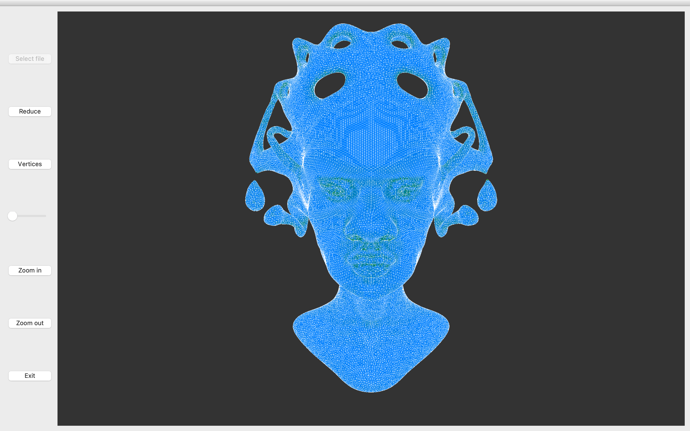
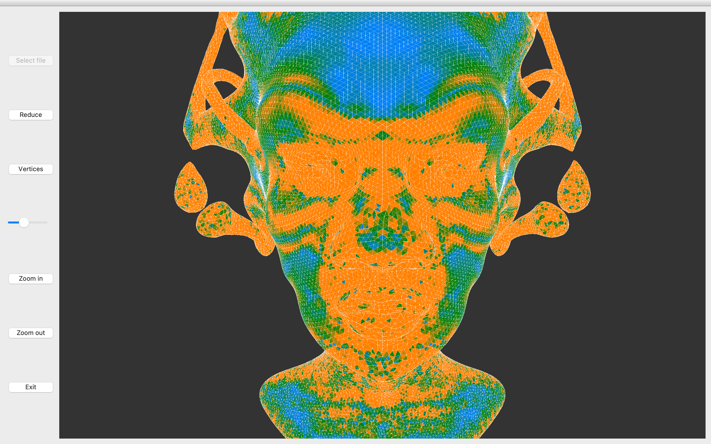
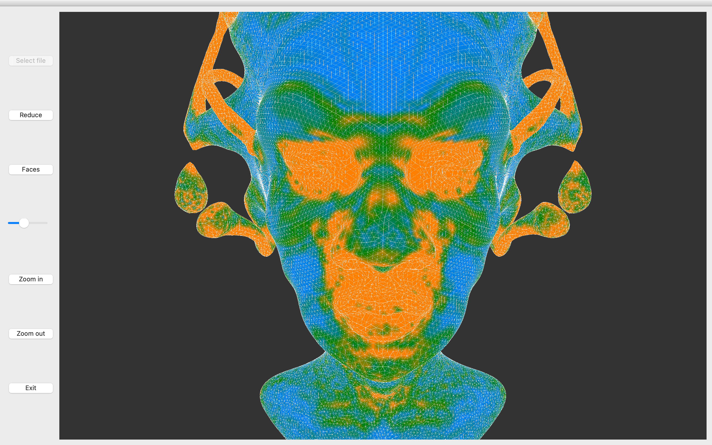
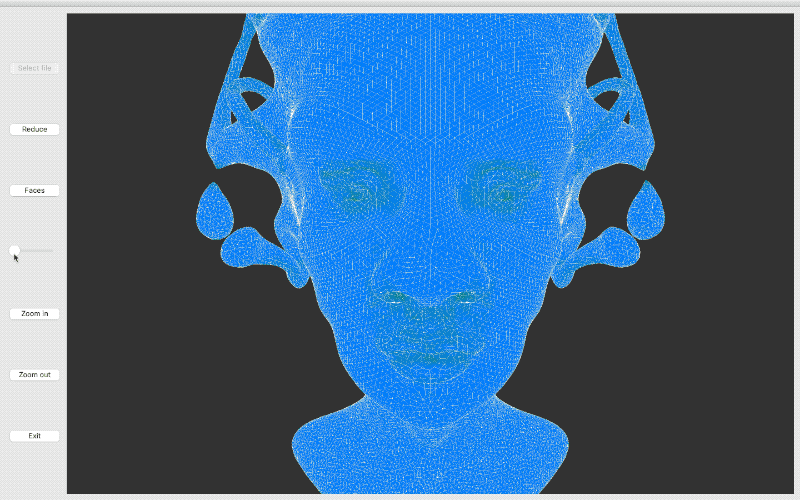
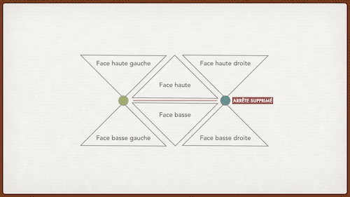

# Calcul et modélisation géométrique pour l'informatique graphique

> AdrKacz (@AdrKacz), Maxime Beaufreton, ECL, MSO 3.6, Calcul et modélisation géométrique pour l'informatique graphique, Raphaëlle Chaine

> Le code ci-dessous sera tout le temps, sauf indiqué, du pseudo-code, pour faciliter la lecture

Réalisation d'une interface graphique avec [Qt](https://www.qt.io) pour le traitement d'un maillage 3D.

L'interface a les fonctionalités suivantes :
- Chargement d'un maillage
- Courbure
    - Par faces
    - Par sommets
    - *Possibilité de changer le seuil de sensibilité*
- Réduction du nombre de sommets
- Ajout de nouveaux sommets
- ~~Transformation en une triangulation de Delaunay~~

# Comment exécuter le code ?

## En mode développement

1. Ouvrir le dossier dans **Qt Creator**
2. Configurer l'exécution
3. Lancer le programme

> Le code source est dans le dossier `./src/Mesh_Computational_Geometry`. La gros du travail est dans le fichier `./src/Mesh_Computational_Geometry/mesh.cpp`

## En mode utilisateur

~~Lancer l'exécutable `InformatiqueGraphique`.~~

# Chargement d'un maillage

Un `mesh` est composé de :
- `vertices`
    - `point`: position dans l'espace
    - `face_index`: indice d'une des `face` adjacentes
    - `index`: indice dans le tableau de données `.off`
- `faces`
    - `vertice_indexes`: indice des `vertices` composants la `face`
    - `face_indexes`: indice des `faces` adjacentes
    - `index`: indice dans le tableau de données `.off`

```
FOR line in file:
    IF line IS vertice:
        vertice = Vertice(line)
        ADD vertice TO vertices
    ELSE:
        face = Face(line)
        FOR v in vertices of face:
            IF NOT v.face_index:
                v.face_index = face.index
        
        FOR i IN 1..3:
            next_index = face.vertice_indexes[(i + 1) % 3].index
            next_next_index = face.vertice_indexes[(i + 2) % 3].index
            side_key = sorted(next_index, next_next_index)
            IF side_key IN sides:
                adjacent_face = sides[side_key]
                ADD face TO adjacent_face.face_indexes
                ADD adjacent_face TO face.face_indexes
            ELSE:
                ADD face TO queue AT side_key
```

<p float="left" align="middle">
    
</p>

# Courbure

Pour mesurer la courbure, on mesure la normal en chaque `face` et chaque `vertice`. On mesure ensuite **la différence entre les normales**.

Cela revient à calculer le **laplacien** en chaque `face` et chaque `vertice`.

> On n'a pas besoin de calculer le **laplacien** en chaque `face` et le **laplacient** en chaque `vertice`. Calculer le **laplacien** en chaque `face` permet d'afficher la courbure par `face`, qui est **cabossée**. C'est pourquoi on lisse la courbure avec le calcul du **laplacien** en chaque `vertice`.

## Par faces

<p float="left" align="middle">
    
</p>

## Par sommets

<p float="left" align="middle">
    
</p>

## Possibilté de changer le seuil de sensibilté

Les disparités dans les normales du **laplacien** sont importantes. On a donc du mal à observer tout le spectre de courbure sur la figure.

Pour pallier à ce problème, on ajoute un *slider* permettant de sélectionner le **seuil de sensibilité** et ainsi de mieux voir les petites variations de courbure.

<p float="left" align="middle">
    
</p>

# Réduction du nombre de sommets

> Malheuresement j'ai eu un problème avec mon ordinateur cette semaine. Ce qui m'a forcé à réinstaller la plupart de mes logiciels, dont **Qt**. Impossible de compiler le programme depuis. L'ordinateur de Maxime ne pouvait déjà pas faire tourner Qt. Je n'ai donc pas eu le temps de faire des captures d'écran de la *réduction du nombre de sommets*.

Pour réduire le nombre de sommets on supprime les arrêtes une par, un nombre de fois prédéfini.

<p float="left" align="middle">
    
</p>

Supprimer une arrête consiste à :
1. trouver ses faces adjacentes **I** et **J**,
2. trouver les faces adjacentes **A**, **B**, **C**, et **D** de **I** et **J**,
3. relier **A**, **B**, **C**, et **D**,
4. placer le point restant de l'arrête supprimée au milieu.

```c
// sommet_oppose en coordonnée local {0, 1, 2}
FUNCTION supprimer_arrete (face, local_sommet_oppose):
    // === TROUVER LES FACES ADJACENTES ===
    // Face haute
    face_haute = face

    local_sommet_droit = (local_sommet_oppose + 1) % 3
    local_sommet_gauche = (local_sommet_oppose + 2) % 3

    face_haute_droite = face_haute.face_voisines[local_sommet_droit]
    face_haute_gauche = face_haute.face_voisines[local_sommet_gauche]

    // Ces deux sommets sont communs aux deux faces (sommets de l'arrête)
    sommet_droit = face.sommets_voisin[sommet_droit]
    sommet_gauche = face.sommets_voisin[sommet_gauche]

    // Face basse
    face_basse = face_haute.face_voisines[sommet_oppose]
    
    local_sommet_droit = face_basse.trouver_sommet_dans_voisins(sommet_droit)
    local_sommet_gauche = face_basse.trouver_sommet_dans_voisins(sommet_gauche)

    // On inverse parce que les faces sont opposées
    face_basse_droite = face_basse.face_voisines[local_sommet_gauche]
    face_basse_gauche = face_basse.face_voisines[local_sommet_droit]

    // === RELIER LES FACES ENTRES ELLES ===
    // On tourne autour du sommet_gauche pour tout attacher au sommet_droit
    face = face_haute
    FAIRE:
        local_sommet_gauche = face.trouver_sommet_dans_voisins(sommet_gauche)
        face.sommet_voisins[local_sommet_gauche] = sommet_droit

        face = face.face_voisines[(local_sommet_gauche + 1) % 3]
    TANT QUE face DIFFERENTE face_haute


    // === DEPLACER LE SOMMETS RESTANTS ===
    sommets[sommet_droit] = (sommets[sommet_droit] + sommets[sommet_gauche]) / 2
```